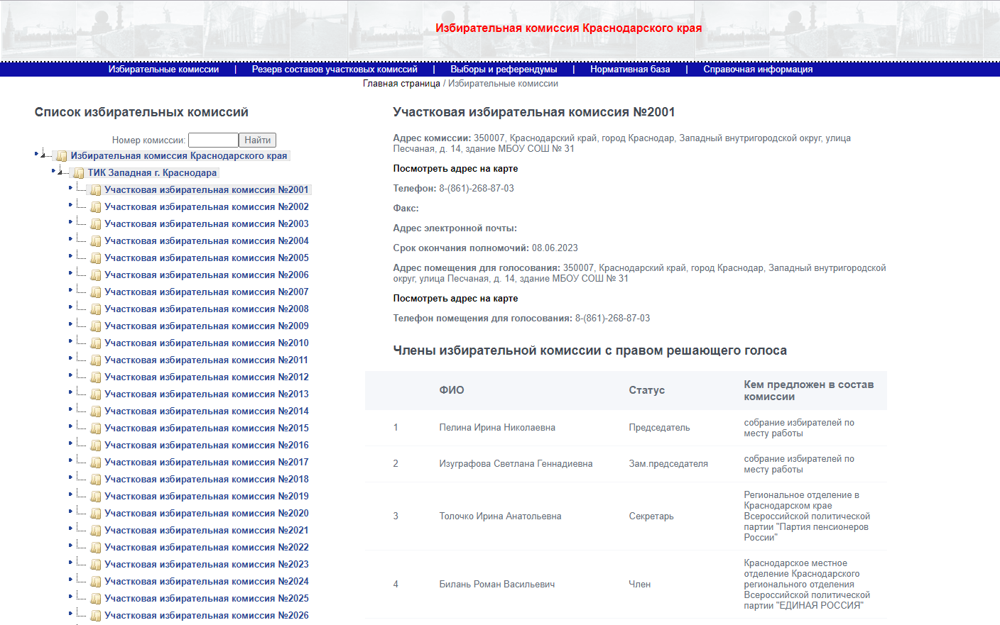
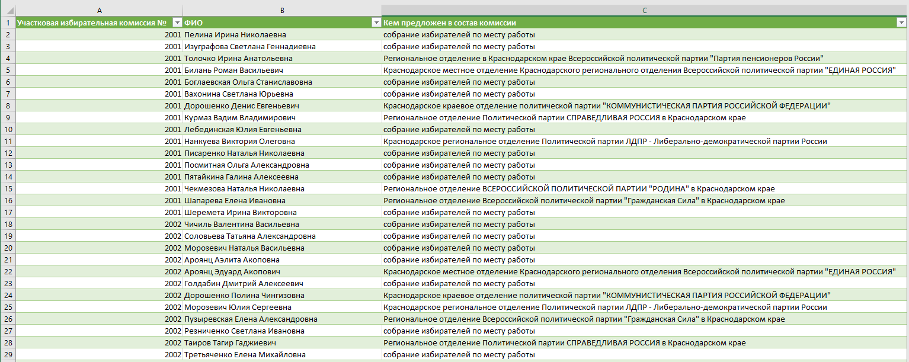
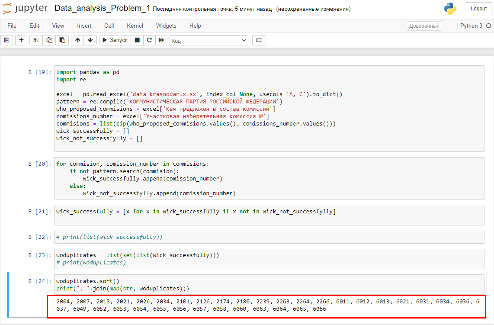
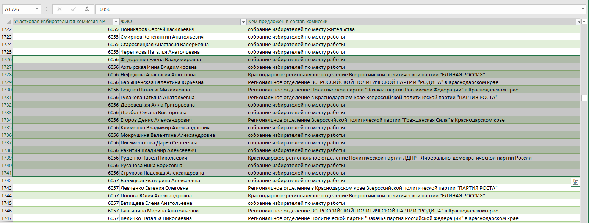
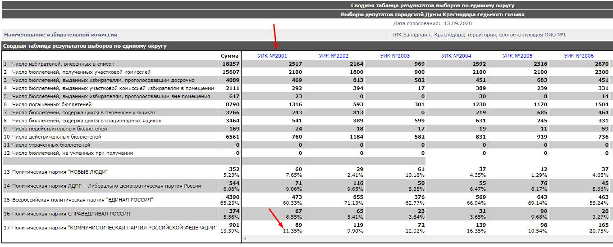
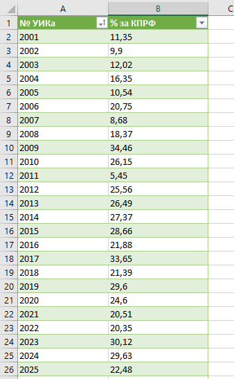
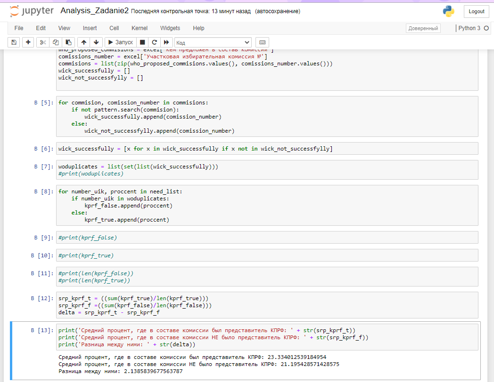

# Тестовое задание в компанию Utair

## Документация

#### Постановка первой задачи:  

> 13 сентября в Краснодаре прошли выборы в городскую думу.
> Выведите в консоль номера УИК, в составе которых не было представителя КПРФ.  
> Формат выхода - номера УИК через запятую.

Изучив данный в условии сайт (www.krasnodar.vybory.izbirkom.ru/region/krasnodar)  
Я начал искать данные составов УИКов, ожидая получить CSV файл или xlsx таблицу. К моему сожалению данные были представлены лишь в виде информации на сайте, да еще и расположены в разных категориях разных ТИКов. Так как в поставленной задаче обсуждаются выборы только в городе Краснодар, делаю вывод что нужны только следующие ТИКи:

- ТИК Западная г. Краснодара
- ТИК Калининская г. Краснодара
- ТИК Карасунская г. Краснодара
- ТИК Прикубанская г. Краснодара
- ТИК Центральная г. Краснодара

Для того чтобы получить данные по каждому УИКу отобранных ТИКов, было принято решение парсить сайт.  
Для парсинга я использовал ЯП Python 3.8.6 и следующие библиотеки:  
(все использованные зависимости прописаны в файле requirements.txt)

- Beautifulsoup4
- Requests

Парсер (parser.py) выполнял работу в два этапа:

1. Спарсил данные всех УИКов в ТИК Западная г. Краснодара. Этот ТИК парсился отдельно, так как в его структуре были удобно подобранны ссылки, исследовав страницы - были найдены закономерности, каждая ссылка для отдельного УИКа отличалась последними цифрами с промежутком в 2 единицы. Благодаря этому, этот ТИК спарсился в автоматическом режиме. 

2. Во всех остальных ТИКах, УИКи были составлены по ссылкам, в которых я не нашел закономерность и какую либо логику. Так же не увидел возможность спарсить эти ссылки.  
В файле urls_for_parsing.py я составил список, состоящий из всех остальных нужных мне ссылок. Немного изменив условия, написанного ранее парсера, я дополнил предыдущий файл с данными.

Результатом работы стала таблица data_krasnodar.xlsx состоящая из 5171 строк.

Далее для анализа данных я использовал следующие инструменты:

- Jupyter Notebook (Anaconda 3)
- Библиотека Pandas 
- Библиотека Re (для определения регулярных выражений)

В блокноте Data_analysis_Problem_1.ipynb был написан код, конечным выводом которого является перечисление через запятую всех номеров УИК, в которых нет представителя партии КПРФ.

Для ручной проверки беру любой из перечисленных номеров, например № 6056.  
Как видно на скриншоте снизу, действительно УИК под номером 6056 не содержит представителя партии КПРФ.

Первую поставленную задачу считаю выполненной.

#### Постановка второй задачи:

> Выведите в консоль на сколько отличается средний результат КПРФ на участках, где в составе комиссии был
> представитель КПРФ от тех, где его не было.
> Формат выхода - (результат КПРФ в % в первой группе, результат КПРФ в % во второй группе, дельта между ними)

Для того, чтобы получить эти данные, необходимо спарсить 39 табличных страниц с выделенными на скриншоте показателями (номер УИКа, процент).

На мои запросы сайт выкидывал капчу, и решить эту проблему подстановкой user-agent не удалось, было принято решение сохранить страницы и парсить их локально.  
Я написал новый парсер (parser_zadanie2.py), результатом работы стала таблица data_zadanie2.xlsx состоящая из 355 строк.

Далее для анализа полученных данных создаю новый блокнот Jupyter Notebook, (Analysis_Zadanie2.ipynb).
Подгрузив данные из первой части задания, и добавив недавно полученные новые данные с процентами, делаю анализ, результат которого показан ниже на скриншоте:

Вторую поставленную задачу считаю выполненной.