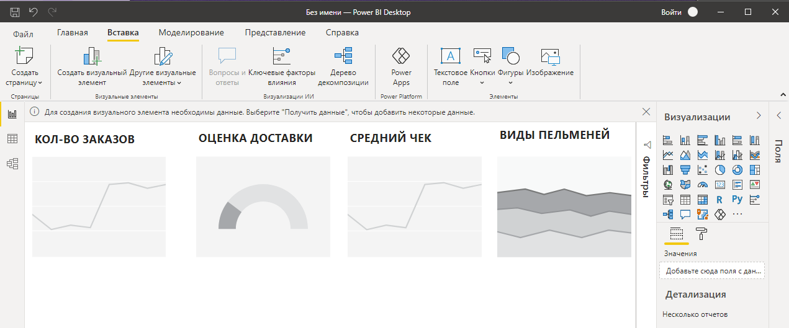
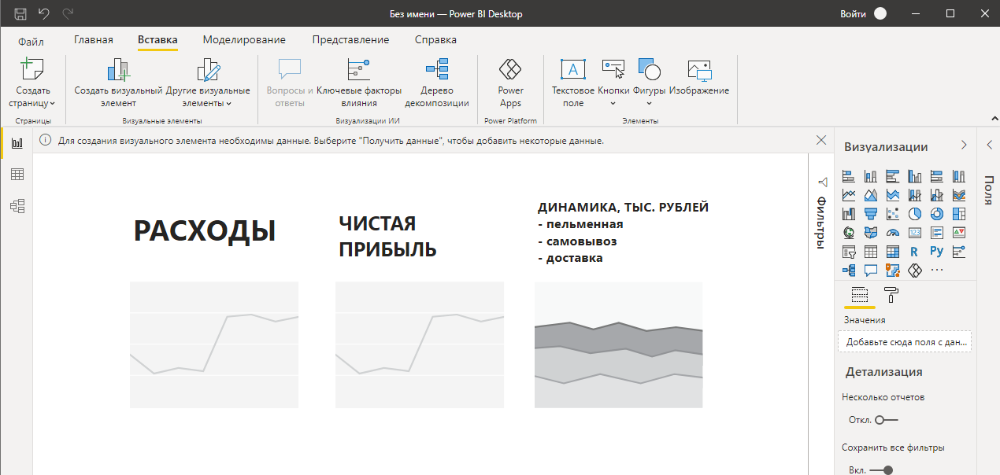

# Тестовое задание в компанию Utair

## Документация

#### Постановка первой задачи:  

> 13 сентября в Краснодаре прошли выборы в городскую думу.
> Выведите в консоль номера УИК, в составе которых не было представителя КПРФ.  
> Формат выхода - номера УИК через запятую.

Изучив данный в условии сайт (www.krasnodar.vybory.izbirkom.ru/region/krasnodar)  
Я начал искать данные составов УИКов, ожидая получить CSV файл или xlsx таблицу. К моему сожалению данные были представлены лишь в виде информации на сайте, да еще и расположены в разных категориях разных ТИКов. Так как в поставленной задаче обсуждаются выборы только в городе Краснодар, делаю вывод что нужны только следующие ТИКи:

- ТИК Западная г. Краснодара
- ТИК Калининская г. Краснодара
- ТИК Карасунская г. Краснодара
- ТИК Прикубанская г. Краснодара
- ТИК Центральная г. Краснодара

Для того чтобы получить данные по каждому УИКу отобранных ТИКов, было принято решение парсить сайт.  
Для парсинга я использовал ЯП Python 3.8.6 и следующие библиотеки:  
(все использованные зависимости прописаны в файле requirements.txt)

- Beautifulsoup4
- Requests

Парсер (parser.py) выполнял работу в два этапа:

1. Спарсил данные всех УИКов в ТИК Западная г. Краснодара. Этот ТИК парсился отдельно, так как в его структуре были удобно подобранны ссылки, исследовав страницы - были найдены закономерности, каждая ссылка для отдельного УИКа отличалась последними цифрами с промежутком в 2 единицы. Благодаря этому, этот ТИК спарсился в автоматическом режиме. 

2. Во всех остальных ТИКах, УИКи были составлены по ссылкам, в которых я не нашел закономерность и какую либо логику. Так же не увидел возможность спарсить эти ссылки.  
В файле urls_for_parsing.py я составил список, состоящий из всех остальных нужных мне ссылок. Немного изменив условия, написанного ранее парсера, я дополнил предыдущий файл с данными.

Результатом работы стала таблица data_krasnodar.xlsx состоящая из 5171 строк.

Далее для анализа данных я использовал следующие инструменты:

- Jupyter Notebook (Anaconda 3)
- Библиотека Pandas 
- Библиотека Re (для определения регулярных выражений)

В блокноте Data_analysis_Problem_1.ipynb был написан код, конечным выводом которого является перечисление через запятую всех номеров УИК, в которых нет представителя партии КПРФ.

Для ручной проверки беру любой из перечисленных номеров, например № 6056.  
Как видно на скриншоте снизу, действительно УИК под номером 6056 не содержит представителя партии КПРФ.

Первую поставленную задачу считаю выполненной.

#### Постановка второй задачи:

> Выведите в консоль на сколько отличается средний результат КПРФ на участках, где в составе комиссии был
> представитель КПРФ от тех, где его не было.
> Формат выхода - (результат КПРФ в % в первой группе, результат КПРФ в % во второй группе, дельта между ними)

Для того, чтобы получить эти данные, необходимо спарсить 39 табличных страниц с выделенными на скриншоте показателями (номер УИКа, процент).

На мои запросы сайт выкидывал капчу, и решить эту проблему подстановкой user-agent не удалось, было принято решение сохранить страницы и парсить их локально.  
Я написал новый парсер (parser_zadanie2.py), результатом работы стала таблица data_zadanie2.xlsx состоящая из 355 строк.

Далее для анализа полученных данных создаю новый блокнот Jupyter Notebook, (Analysis_Zadanie2.ipynb).
Подгрузив данные из первой части задания, и добавив недавно полученные новые данные с процентами, делаю анализ, результат которого показан ниже на скриншоте:

Вторую поставленную задачу считаю выполненной.

#### Постановка третьей задачи:

> Вы хотите поужинать. В холодильнике есть пачка пельменей-вы решаете их приготовить. Опишите бизнес-процесс,
> который приведет вас к нужному результату.

###### Ресурсы:

- Пачка пельменей
- Плита
- Соль
- Вилка
- Ложка
- Тарелка
- Кастрюля
- Дуршлаг
- Лавровый лист
- Телефон
- Вода
- Ножницы

###### Технические операции:

1. Включить на телефоне плейлист: "Хорошее настроение"
2. Включить плиту
3. Наполнить кастрюлю водой
4. Поставить кастрюлю с водой на плиту
5. Взять щепотку соли и посолить
6. Перемешать ложкой
7. Дождаться кипения
8. Кинуть в кастрюлю лавровый лист
9. Достать из холодильника пачку пельменей
10. Разрезать пачку ножницами
11. Высыпать пельмени в кипящую кастрюлю
12. Перемешать ложкой
13. Подождать 5 минут
14. Повторить шаг 12, 13
15. Повторить шаг 14
16. Выключить плиту
17. Поставить в раковину дуршлаг
18. Поднести кастрюлю к раковине
19. Вылить пельмени в дуршлаг
20. Встрахянуть пару раз дуршлаг
21. Положить пельмени в тарелку
22. Поставить тарелку на стол
23. Положить рядом с тарелкой вилку
24. Поставить кастрюлю, ложку и дуршлаг в мойку
25. Выкинуть упаковку в мусор
26. Выключить плейлист
27. Включить на Ютубе что-нибудь занимательное
28. Наслаждаться ужином

#### Постановка четвертой задачи:

> Есть сеть пельменных, в которой люди заказывают пельмени через приложение с доставкой на дом.
> В этой компании есть коммерческий директор и операционный директор.
> Предложите два дашборда, позволяющие им понять все ли идет хорошо в короткой перспективе
> и поясните причину выбора тех или иных показателей для каждой роли.

###### Дашборд для операционного директора:

1. Количество заказов. Позволит наблюдать динамику заказов в разрезе (день/месяц)

2. Оценка доставки. 5 звёздочная шкала доставки, которую заполняет клиент при получении заказа. Позволит узнать в какие дни доставка осуществляется дольше/Позволит узнать, как сильно падает уровень курьерской доставки при увеличении количества заказов.

3. Средний чек. Позволит наблюдать в какие дни (месяца) люди делают заказ насыщеннее.

4. Виды пельменей. Позволит узнать какой вид пельменей клиенты предпочитают меньше всего, что является намеком на пересмотр подхода к приготовлению или отказу от какого-либо вида пельменей. 

###### Дашборд для коммерческого директора:

1. Расходы. Позволит наблюдать динамику расходов в разных разрезах.

2. Чистая прибыль. Позволит наблюдать динамику прибыли в разных разрезах.

3. Динамика тыс.рублей. Позволит наблюдать какое из трех направлений подачи заказов приносит больше прибыли. Что является намеком, например, на отказ от аренды помещения (в случае, если помещение приносит значительно меньшую прибыль или около нулевую (Люди не ходят в ресторан, а только заказывают. Актуально в период самоизоляции)).

#### Представление результата:

Решение всех поставленных задач представлено в публичном репозитории, с подробной документацией по каждой задаче. 